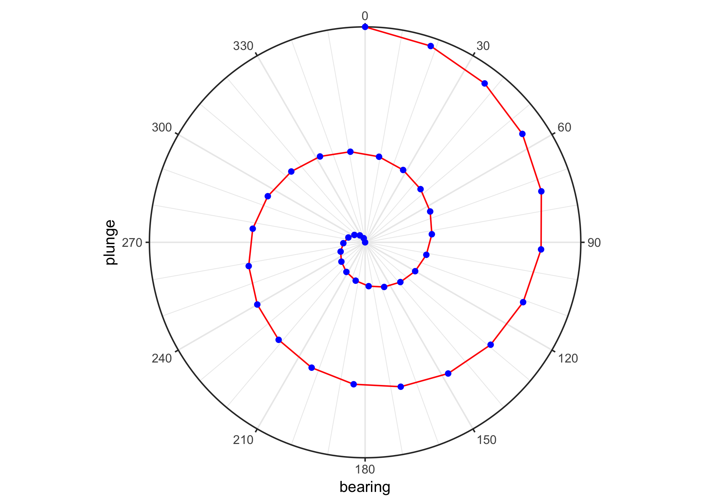

<!-- README.md is generated from README.Rmd. Please edit that file -->
ggstereo
========

[](https://www.tidyverse.org/lifecycle/#experimental)

The goal of ggstereo is to make stereonet visualizations of 3D orientation information possible using ggplot2. It is currently a work in progress and is under active development.

Installation
------------

You can install ggstereo from github with:

``` r
# install.packages("remotes")
remotes::install_github("paleolimbot/ggstereo")
```

Example
-------

Plot points that have a bearing and a dip on a stereonet with an orthographic projection:

``` r
library(ggplot2)
library(ggstereo)

df <- data.frame(
  bearing = seq(0, 4*180, length.out = 40),
  dip = seq(0, 90, length.out = 40)
)

ggplot(df, aes(bearing, dip)) +
  geom_path(col = "red") +
  geom_point(col = "blue") +
  coord_bearing_dip() +
  scale_x_continuous(breaks = seq(0, 330, by = 30)) +
  theme_bw()
#> Warning: Range calc not implemented
```


